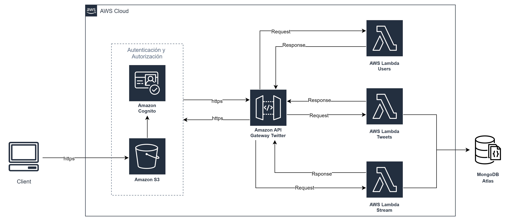

# AREP - Taller 8

## Descripción

En este laboratorio se diseñará un API RESTful con Quarkus para permitir a los usuarios realizar posts de hasta 140 caracteres, 
registrándolos en un stream único. Se desarrollará una aplicación web en JavaScript que interactúe con este servicio, la cual 
se desplegará en AWS S3. Se implementará seguridad utilizando JWT y AWS Cognito. Posteriormente, se dividirá el monolito en tres 
microservicios independientes utilizando AWS Lambda, desplegándolos en la nube.


## Comenzando

Las siguientes instrucciones le permitirán obtener una copia del proyecto en funcionamiento en su máquina local para fines de desarrollo y prueba.

### Requisitos

- [Git](https://www.youtube.com/watch?v=4xqVv2lTo40/) - Control de versiones
- [Maven](https://www.youtube.com/watch?v=1QfiyR_PWxU) - Gestor de dependencias
- [Java 17](https://www.youtube.com/watch?v=BG2OSaxWX4E) - Lenguaje de programación

## Instalación

Para hacer una copia local del proyecto, debemos abrir nuestra terminal, dirigirnos al directorio donde estará el proyecto y usar el siguiente comando

```bash
git clone https://github.com/andreaduranvivas/AREP-Taller8
```

Nos dirigimos al directorio creado con

```bash
cd AREP-Taller8
```


## Ejecutando la aplicación


Para ejecutar la aplicación, primero debemos compilar el proyecto con el siguiente comando `mvn clean package`
. Esto nos permitirá limpiar las construcciones previas de otras versiones y luego compilará el proyecto.

Y ejecutamos el siguiente comando para correr el repositorio con quarkus

```bash
mvn quarkus:dev
```

Para visualizar la aplicación, escogemos algún navegador e ingresamos la URL http://localhost:8080/ en la barra de direcciones. Allí encontraremos la primera página de la aplicación,
la cual se basa en un formulario para iniciar sesión o registrarse. Una vez se inicie la sesión, hallaremos un formulario donde se podrían subir y ver los últimos tweets,
los cuales estarán alamacenados en la base de datos.


A continuación se presenta un video demostrando el funcionamiento de la aplicación, haciendo uso de S3 en AWS.
Para ello usamos AWS Cognito, dos servicios lambda, y un API gateway

[](https://youtu.be/AINZ3AHpHRU)


## Pruebas

Las pruebas realizadas abarcan distintos aspectos de la funcionalidad de una aplicación que maneja tweets, incluyendo la creación de tweets, la persistencia de datos en una base de datos MongoDB, 
y la lógica de negocio relacionada con la gestión de tweets. Las pruebas se pueden correr con el comando `mvn test`
 pruebas:

### Pruebas Unitarias de la Clase `Tweet`

Estas pruebas se centran en la funcionalidad básica de la clase `Tweet`, verificando que los objetos `Tweet` se creen correctamente, 
que sus métodos `equals` y `hashCode` funcionen como se espera, y que la representación en cadena (`toString`) de un objeto `Tweet` sea la esperada. 
Además, se incluye una prueba para validar que la longitud del contenido de un tweet no exceda los 140 caracteres, asegurando que la validación 
de longitud esté funcionando correctamente.

### Pruebas de Integración de la Conexión a MongoDB

Estas pruebas verifican que la aplicación pueda conectarse correctamente a una base de datos MongoDB y que la colección de tweets esté disponible
para su uso. Se utiliza la anotación `@QuarkusTest` para indicar que estas pruebas son pruebas de integración que requieren un entorno de ejecución completo, 
incluyendo la inicialización de recursos como la conexión a la base de datos.


### Pruebas de la Persistencia de Tweets

Estas pruebas se centran en la lógica de negocio relacionada con la persistencia de tweets en la base de datos. 
Verifican que los tweets se puedan insertar correctamente en la base de datos y que se pueda recuperar un tweet por su ID. 
Estas pruebas también aseguran que la lista de los últimos posts esté ordenada correctamente por el ID del tweet en orden descendente.


### Pruebas del Servicio de Stream

Estas pruebas se centran en la lógica de negocio relacionada con la gestión de streams de tweets. Utilizan mocks para simular la persistencia de datos, 
permitiendo probar la lógica de negocio sin depender de una base de datos real. Verifican que el servicio pueda recuperar correctamente los últimos posts de un stream.


### Pruebas del Servicio de Tweets

Estas pruebas se centran en la lógica de negocio relacionada con la gestión de tweets, incluyendo la adición de nuevos tweets. A
l igual que las pruebas del servicio de stream, utilizan mocks para simular la persistencia de datos. Verifican que un tweet se pueda agregar 
correctamente y que la persistencia de datos se llame con los parámetros esperados.


## Documentación

Para visualizar la documentación del proyecto solo debes correr el siguiente comando desde el directorio raiz del proyecto

```bash
mvn javadoc:javadoc
```

Y en la siguiente ruta encontrarás el archivo index.html en donde si lo abres desde el navegador podras ver toda la documentación

```
./target/site/apidocs
```

## Arquitectura de la aplicación

La arquitectura del prototipo consta de los siguientes componentes:

- **Cliente S3:** Representa el servicio S3 de AWS, con el que dejaremos alojados todos los archivos relacionados con el FrontEnd de nuestra aplicación.

- **AWS Cognito:** Servicio de AWS con el que se hará la autenticación de los usuarios.

- **StreamService:** Una función lambda encargada de mostrar los últimos posts.

- **TweetService:** Una función lambda encargada de agregar y crear tweets.

- **MongoDB:** Es la base de datos donde almacenaremos los tweets.

A continuación se ve el diagrama de la arquitectura.



## Autores

- **Andrea Durán** - [Usuario en GitHub](https://github.com/andreaduranvivas)
- **Camilo Fajardo** - [Usuario en GitHub](https://github.com/briancfajardo)

## Construido con

* [Quarkus](https://quarkus.io/) - Java framework tailored for deployment on Kubernetes
* [Maven](https://maven.apache.org/) - Dependency Management
* [Java](https://www.java.com/es/) - Programming Language
* [JavaScript](https://developer.mozilla.org/en-US/docs/Web/javascript) - Programming Language
* [CSS](https://www.w3.org/Style/CSS/Overview.en.html) - stylesheet Language
* [HTML](https://html.com/) - HyperText Markup Language
* [AWS](https://html.com/) - Amazon Web Services


## Versiones


## Licencia

Este proyecto está bajo la licencia MIT. Ver el archivo [LICENSE](LICENSE) para más detalles.

## Agradecimientos

- Al profesor [Luis Daniel Benavides Navarro](https://ldbn.is.escuelaing.edu.co/)

